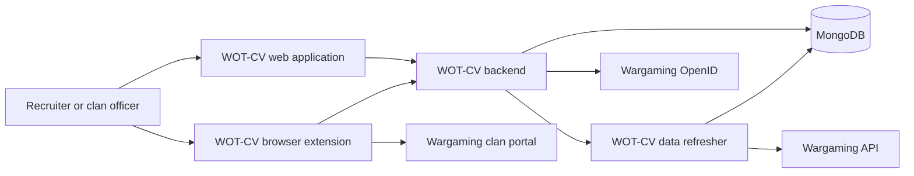
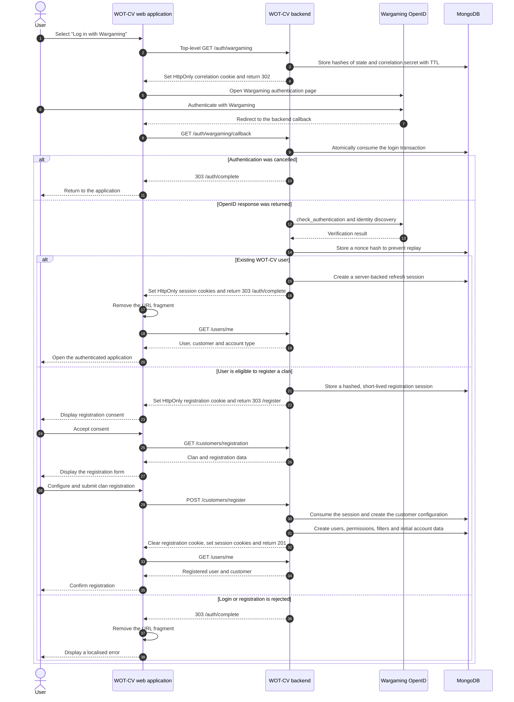
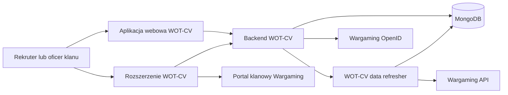
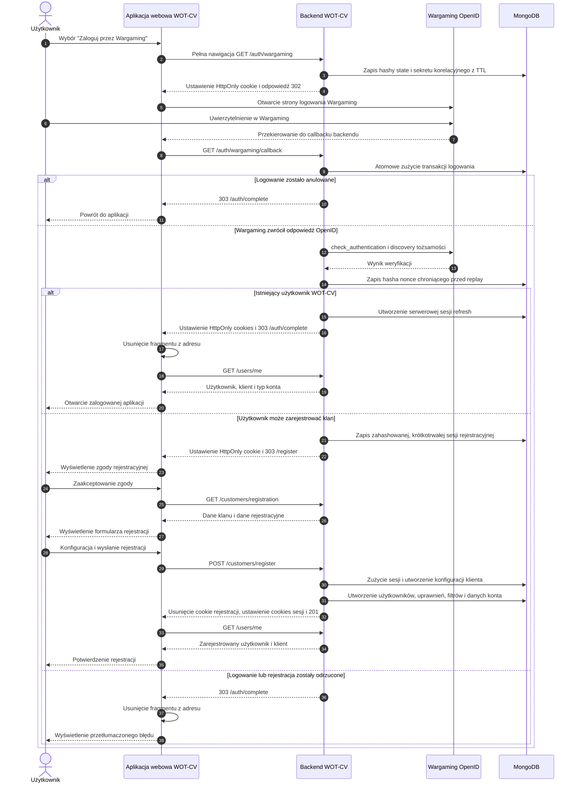

<div align="center">

<p>
  
</p>

<p>
  
</p>

<br />

**[ENGLISH](#english)&nbsp;&nbsp;|&nbsp;&nbsp;[POLSKI](#polski)**

</div>

---

<a id="english"></a>

<div align="center">

# [WOT-CV](https://wot-cv.com)

### Recruitment platform for [World of Tanks](https://worldoftanks.eu/) clans

</div>

## Table of Contents

1. [Description](#en-description)
2. [Start Here](#en-start)
3. [Ecosystem](#en-ecosystem)
4. [Key Features](#en-key-features)
5. [Account Types](#en-account-types)
6. [Authentication and Clan Registration](#en-authentication)
7. [Technologies](#en-technologies)
8. [User Requirements](#en-user-requirements)
9. [Security and Privacy](#en-security)
10. [Repositories and Documentation](#en-repositories)
11. [Authors](#en-authors)
12. [License and Trademarks](#en-license)

---

<a id="en-description"></a>

## Description

[WOT-CV](https://wot-cv.com) is an ecosystem of applications that supports the recruitment of players to [World of Tanks](https://worldoftanks.eu/) clans.

The platform helps clan staff discover potential recruits, apply configurable recruitment criteria, review candidates, manage access for clan members, analyse recruitment results and automate selected activities through a browser extension.

WOT-CV was created as a hobby project by [Daniel Owczarczyk](https://www.linkedin.com/in/daniel-owczarczyk-8b89a6150) and [Marek Brajerski](https://www.linkedin.com/in/marek-brajerski).

<a id="en-start"></a>

## Start Here

1. Open [wot-cv.com](https://wot-cv.com).
2. Select login with Wargaming. Authentication takes place on Wargaming's website and returns through the WOT-CV backend.
3. If your clan is already registered, WOT-CV opens the application with the permissions assigned to your account.
4. If your clan is not registered and you hold a supported officer role, accept the registration consent, review the detected clan data and complete the initial configuration.
5. Configure recruitment filters and access for clan members.
6. Optionally install the [WOT-CV browser extension](https://github.com/WoT-CV/wot-cv-extension) to automate invitations on the Wargaming clan portal.

The browser extension is optional. The web application, backend and data refresher provide the core recruitment workflow.

<a id="en-ecosystem"></a>

## Ecosystem

WOT-CV consists of four cooperating applications:

- **Web application** — the user interface used by recruiters and clan staff.
- **Backend** — public APIs, authentication, authorization and business logic.
- **Data refresher** — scheduled data collection, transformation, migrations and maintenance.
- **Browser extension** — integration with the Wargaming clan portal and automated invitations.



The integration direction is intentional: the backend may invoke selected data-refresher operations, while the data refresher does not call the backend through REST.

<a id="en-key-features"></a>

## Key Features

- **Potential recruit discovery** — finds players who may match clan requirements.
- **Advanced recruitment filters** — configurable criteria based on player statistics, activity, vehicles and communication language.
- **Players-to-check queue** — a structured workflow for reviewing candidates.
- **Recruitment history** — a record of previously analysed players.
- **Recruitment statistics** — insights into the effectiveness of clan recruitment.
- **Clan administration** — management of access and permissions for clan members.
- **Player and clan blocklist** — prevents unsuitable candidates from returning to recruitment results.
- **Browser extension** — supports automated invitations from the Wargaming clan portal.
- **Internationalisation** — English, Polish, German, Czech and Russian user interfaces.

<a id="en-account-types"></a>

## Account Types

WOT-CV uses three account types:

| Account type | Description |
| --- | --- |
| **FREE** | Provides access to the core recruitment workflow with product limits. |
| **PREMIUM** | Provides premium capabilities and expanded or unlimited limits. |
| **TESTER** | Behaves like a premium account and may additionally receive features enabled only for testers. |

`PREMIUM` and `TESTER` are treated equally when a feature requires premium access. The separate `TESTER` type allows selected experimental features to be released to testers before a wider rollout.

<a id="en-authentication"></a>

## Authentication and Clan Registration

WOT-CV uses **Wargaming OpenID 2.0**. Wargaming authenticates the player; WOT-CV never receives the player's Wargaming password.

The frontend starts authentication by performing a full browser navigation to:

```text
GET /web/api/wot-cv/auth/wargaming
```

The backend creates a short-lived, single-use login transaction, sets a secure correlation cookie and redirects the browser to Wargaming. After authentication, Wargaming redirects the browser to the backend callback:

```text
GET /web/api/wot-cv/auth/wargaming/callback
```

The backend validates the OpenID response directly with Wargaming, verifies the claimed identity and protects the callback against replay. The frontend does not validate or process the OpenID assertion.



### Existing users

An existing WOT-CV user receives a normal web session. Authentication data is stored in secure, HttpOnly cookies. The frontend then calls `/users/me` to load the authenticated user, customer and account type.

### New clan registration

A new user may register a clan when:

- the player exists in the Wargaming API;
- the player belongs to a clan;
- that clan is not already registered in WOT-CV;
- the player has a supported officer role.

The backend creates a separate short-lived registration session. This is not yet a normal authenticated WOT-CV session.

The registration page first displays the required consent. Registration data is requested only after the user accepts it. When the registration form is submitted, the backend atomically consumes the registration session, creates the customer configuration and starts a normal authenticated session.

### Callback results

The backend redirects the browser only with a fixed status or error code in the URL fragment. Authentication tokens and OpenID assertions are never included in that fragment. The frontend removes the fragment immediately after reading it.

<a id="en-technologies"></a>

## Technologies

The tables below show the current major technology lines. Exact and binding versions are defined by each repository's `pom.xml`, `package.json`, lockfile and browser manifests.

### Backend

| Area | Technology |
| --- | --- |
| Language | Java 25 |
| Framework | Spring Boot 4.1 |
| Architecture | Multi-module Ports and Adapters |
| Persistence | MongoDB and Spring Data MongoDB |
| API documentation | OpenAPI and Springdoc |
| Tests | Spock and WireMock |
| Build | Maven |
| Observability | OpenTelemetry and Logbook |
| Concurrency | Virtual threads |

### Data Refresher

| Area | Technology |
| --- | --- |
| Language | Java 25 |
| Framework | Spring Boot 4.1 |
| Scheduling | Spring scheduling and dedicated executors |
| Persistence | MongoDB and Spring Data MongoDB |
| Migrations | Mongock |
| External data | Wargaming API and configured data providers |
| Tests | Spock and WireMock |
| Build | Maven |
| Observability | OpenTelemetry |

### Web Application

| Area | Technology |
| --- | --- |
| UI | React 19 |
| Language | TypeScript 6 |
| Component library | Material UI 9 |
| State and API | Redux Toolkit and RTK Query |
| Routing | React Router 7 |
| Build | Vite 8 |
| Forms | Formik |
| Internationalisation | i18next |
| Unit tests | Vitest and React Testing Library |
| End-to-end tests | Playwright |
| Package manager | Yarn 4 |
| Runtime used by CI | Node.js 24 |

### Browser Extension

| Area | Technology |
| --- | --- |
| Platform | Chrome and Firefox Manifest V3 |
| Language | TypeScript 6 |
| Build | Vite 8 |
| HTTP client | Axios |
| Tests | Vitest |
| Package manager | Yarn 4 |
| Runtime used by CI | Node.js 24 |

<a id="en-user-requirements"></a>

## User Requirements

To register a clan in WOT-CV, a user must:

1. Have a [Wargaming.net](https://wargaming.net/) account.
2. Be a member of a [World of Tanks](https://worldoftanks.eu/) clan.
3. Hold one of the supported clan roles:
   - Commander;
   - Executive Officer;
   - Personnel Officer;
   - Combat Officer;
   - Intelligence Officer;
   - Quartermaster;
   - Recruitment Officer;
   - Junior Officer.

Users of an already registered clan receive access according to permissions configured by the clan administrators.

<a id="en-security"></a>

## Security and Privacy

- Wargaming authenticates the player; WOT-CV never receives the Wargaming password.
- The backend validates OpenID responses directly with Wargaming.
- Login state, correlation secrets, nonces and registration secrets are stored as hashes rather than raw values.
- Login and registration transactions are short-lived and single-use.
- Authentication and registration cookies are HttpOnly and Secure.
- The frontend receives only fixed completion or error codes.
- Public game and clan information is obtained through the official [Wargaming API](https://developers.wargaming.net/).
- Authentication tokens are carried in secure backend cookies and are not exposed to frontend storage.
- Browser-extension pairing is verified against the backend rather than inferred from a local cookie.

Security-sensitive reports must not include credentials, session cookies, pairing codes or personal data in a public issue. Use a private channel to contact the maintainers and rotate any credential that may already have been disclosed.

<a id="en-repositories"></a>

## Repositories and Documentation

| Repository | Responsibility |
| --- | --- |
| [wot-cv-be](https://github.com/WoT-CV/wot-cv-be) | Backend APIs, authentication, authorization and business logic |
| [wot-cv-fe](https://github.com/WoT-CV/wot-cv-fe) | React web application |
| [wot-cv-data-refresher](https://github.com/WoT-CV/wot-cv-data-refresher) | Scheduled data refresh, migrations and maintenance |
| [wot-cv-extension](https://github.com/WoT-CV/wot-cv-extension) | Chrome and Firefox browser extension |

Documentation has explicit ownership:

- this organization profile explains the product and the relationships between applications;
- each repository README is the entry point for its architecture, local setup, tests, operational constraints and troubleshooting;
- backend OpenAPI documents are the source of truth for HTTP paths, methods, payloads and enums;
- `pom.xml`, `package.json`, lockfiles and browser manifests are the source of truth for exact dependency and platform versions;
- runtime configuration files and deployment secrets define environment-specific behaviour, but secrets must never be copied into documentation.

Cross-application changes should update all affected READMEs and generated API clients in the same coordinated release.

<a id="en-authors"></a>

## Authors

[Daniel Owczarczyk](https://www.linkedin.com/in/daniel-owczarczyk-8b89a6150) and [Marek Brajerski](https://www.linkedin.com/in/marek-brajerski)

<a id="en-license"></a>

## License and Trademarks

WOT-CV is a hobby project. Licensing or distribution terms, where applicable, are defined in the individual repositories.

[World of Tanks](https://worldoftanks.eu/) and Wargaming-related names and marks belong to their respective owners. WOT-CV is not an official Wargaming product.

---

<a id="polski"></a>

<div align="center">

# [WOT-CV](https://wot-cv.com)

### Platforma rekrutacyjna dla klanów [World of Tanks](https://worldoftanks.eu/)

</div>

## Spis treści

1. [Opis](#pl-opis)
2. [Zacznij tutaj](#pl-start)
3. [Ekosystem](#pl-ekosystem)
4. [Główne funkcjonalności](#pl-funkcjonalnosci)
5. [Typy kont](#pl-typy-kont)
6. [Logowanie i rejestracja klanu](#pl-logowanie)
7. [Technologie](#pl-technologie)
8. [Wymagania dla użytkowników](#pl-wymagania)
9. [Bezpieczeństwo i prywatność](#pl-bezpieczenstwo)
10. [Repozytoria i dokumentacja](#pl-repozytoria)
11. [Autorzy](#pl-autorzy)
12. [Licencja i znaki towarowe](#pl-licencja)

---

<a id="pl-opis"></a>

## Opis

[WOT-CV](https://wot-cv.com) jest ekosystemem aplikacji wspierających rekrutację graczy do klanów w grze [World of Tanks](https://worldoftanks.eu/).

Platforma pomaga członkom sztabu klanu wyszukiwać potencjalnych rekrutów, stosować konfigurowalne kryteria rekrutacyjne, analizować kandydatów, zarządzać dostępem członków klanu, sprawdzać skuteczność rekrutacji oraz automatyzować wybrane czynności przy użyciu rozszerzenia przeglądarki.

WOT-CV powstało jako projekt hobbystyczny [Daniela Owczarczyka](https://www.linkedin.com/in/daniel-owczarczyk-8b89a6150) i [Marka Brajerskiego](https://www.linkedin.com/in/marek-brajerski).

<a id="pl-start"></a>

## Zacznij tutaj

1. Otwórz [wot-cv.com](https://wot-cv.com).
2. Wybierz logowanie przez Wargaming. Uwierzytelnienie odbywa się na stronie Wargaming, a powrót prowadzi przez backend WOT-CV.
3. Jeżeli klan jest już zarejestrowany, WOT-CV otworzy aplikację z uprawnieniami przypisanymi do konta.
4. Jeżeli klan nie jest zarejestrowany, a użytkownik ma obsługiwaną rolę oficerską, należy zaakceptować zgodę rejestracyjną, sprawdzić wykryte dane klanu i zakończyć konfigurację początkową.
5. Skonfiguruj filtry rekrutacyjne oraz dostęp członków klanu.
6. Opcjonalnie zainstaluj [rozszerzenie przeglądarki WOT-CV](https://github.com/WoT-CV/wot-cv-extension), aby automatyzować zaproszenia w portalu klanowym Wargaming.

Rozszerzenie jest opcjonalne. Aplikacja webowa, backend i data-refresher dostarczają podstawowy proces rekrutacyjny.

<a id="pl-ekosystem"></a>

## Ekosystem

WOT-CV składa się z czterech współpracujących aplikacji:

- **Aplikacja webowa** — interfejs używany przez rekruterów i członków sztabu klanu.
- **Backend** — publiczne API, logowanie, autoryzacja i logika biznesowa.
- **Data refresher** — cykliczne pobieranie i przetwarzanie danych, migracje oraz utrzymanie danych.
- **Rozszerzenie przeglądarki** — integracja z portalem klanowym Wargaming i automatyczne zapraszanie.



Kierunek integracji jest celowy: backend może wywoływać wybrane operacje data-refreshera, natomiast data-refresher nie wywołuje backendu przez REST.

<a id="pl-funkcjonalnosci"></a>

## Główne funkcjonalności

- **Wyszukiwanie potencjalnych rekrutów** — odnajdywanie graczy, którzy mogą spełniać wymagania klanu.
- **Zaawansowane filtry rekrutacyjne** — kryteria oparte na statystykach, aktywności, pojazdach i języku komunikacji.
- **Lista graczy do sprawdzenia** — uporządkowany proces analizowania kandydatów.
- **Historia rekrutacji** — zapis wcześniej przeanalizowanych graczy.
- **Statystyki rekrutacji** — informacje o skuteczności działań rekrutacyjnych.
- **Administracja klanem** — zarządzanie dostępem i uprawnieniami członków klanu.
- **Lista zablokowanych graczy i klanów** — zapobieganie ponownemu pojawianiu się nieodpowiednich kandydatów.
- **Rozszerzenie przeglądarki** — automatyzacja zaproszeń z portalu klanowego Wargaming.
- **Wielojęzyczność** — interfejs angielski, polski, niemiecki, czeski i rosyjski.

<a id="pl-typy-kont"></a>

## Typy kont

WOT-CV wykorzystuje trzy typy kont:

| Typ konta | Opis |
| --- | --- |
| **FREE** | Dostęp do podstawowego procesu rekrutacji z limitami produktu. |
| **PREMIUM** | Dostęp do funkcjonalności premium oraz rozszerzonych lub nielimitowanych limitów. |
| **TESTER** | Działa jak konto premium i może dodatkowo otrzymywać funkcjonalności przeznaczone wyłącznie dla testerów. |

`PREMIUM` i `TESTER` są traktowane identycznie, gdy funkcjonalność wymaga dostępu premium. Osobny typ `TESTER` pozwala udostępniać wybrane eksperymentalne funkcje testerom przed szerszym wdrożeniem.

<a id="pl-logowanie"></a>

## Logowanie i rejestracja klanu

WOT-CV wykorzystuje **Wargaming OpenID 2.0**. Użytkownik jest uwierzytelniany przez Wargaming, dlatego WOT-CV nigdy nie otrzymuje jego hasła do konta Wargaming.

Frontend rozpoczyna logowanie poprzez pełną nawigację przeglądarki do:

```text
GET /web/api/wot-cv/auth/wargaming
```

Backend tworzy krótkotrwałą, jednorazową transakcję logowania, ustawia bezpieczne cookie korelacyjne i przekierowuje przeglądarkę do Wargaming. Po uwierzytelnieniu Wargaming przekierowuje przeglądarkę do callbacku backendu:

```text
GET /web/api/wot-cv/auth/wargaming/callback
```

Backend bezpośrednio weryfikuje odpowiedź OpenID w Wargaming, sprawdza potwierdzoną tożsamość i zabezpiecza callback przed ponownym wykorzystaniem. Frontend nie weryfikuje ani nie przetwarza odpowiedzi OpenID.



### Istniejący użytkownicy

Istniejący użytkownik WOT-CV otrzymuje normalną sesję webową. Dane uwierzytelnienia znajdują się w bezpiecznych cookies HttpOnly. Frontend wywołuje następnie `/users/me`, aby pobrać użytkownika, klienta i typ konta.

### Rejestracja nowego klanu

Nowy użytkownik może zarejestrować klan, jeżeli:

- gracz istnieje w Wargaming API;
- gracz należy do klanu;
- klan nie jest jeszcze zarejestrowany w WOT-CV;
- gracz ma obsługiwaną rolę oficerską.

Backend tworzy osobną, krótkotrwałą sesję rejestracyjną. Na tym etapie nie jest to jeszcze normalna sesja zalogowanego użytkownika WOT-CV.

Strona rejestracji najpierw wyświetla wymaganą zgodę. Dane rejestracyjne są pobierane dopiero po jej zaakceptowaniu. Po wysłaniu formularza backend atomowo zużywa sesję rejestracyjną, tworzy konfigurację klienta i rozpoczyna zwykłą sesję zalogowanego użytkownika.

### Wynik callbacku

Backend przekazuje frontendowi wyłącznie stały status lub kod błędu umieszczony we fragmencie adresu. Tokeny uwierzytelniające i odpowiedź OpenID nigdy nie są umieszczane w tym fragmencie. Frontend usuwa fragment natychmiast po jego odczytaniu.

<a id="pl-technologie"></a>

## Technologie

Poniższe tabele pokazują aktualne główne linie technologiczne. Dokładne i wiążące wersje znajdują się w plikach `pom.xml`, `package.json`, lockfile'ach i manifestach przeglądarek poszczególnych repozytoriów.

### Backend

| Obszar | Technologia |
| --- | --- |
| Język | Java 25 |
| Framework | Spring Boot 4.1 |
| Architektura | Wielomodułowe Ports and Adapters |
| Baza danych | MongoDB i Spring Data MongoDB |
| Dokumentacja API | OpenAPI i Springdoc |
| Testy | Spock i WireMock |
| Budowanie | Maven |
| Obserwowalność | OpenTelemetry i Logbook |
| Współbieżność | Wątki wirtualne |

### Data Refresher

| Obszar | Technologia |
| --- | --- |
| Język | Java 25 |
| Framework | Spring Boot 4.1 |
| Harmonogramy | Spring Scheduling i dedykowane executory |
| Baza danych | MongoDB i Spring Data MongoDB |
| Migracje | Mongock |
| Dane zewnętrzne | Wargaming API i skonfigurowani dostawcy danych |
| Testy | Spock i WireMock |
| Budowanie | Maven |
| Obserwowalność | OpenTelemetry |

### Aplikacja webowa

| Obszar | Technologia |
| --- | --- |
| UI | React 19 |
| Język | TypeScript 6 |
| Biblioteka komponentów | Material UI 9 |
| Stan i API | Redux Toolkit i RTK Query |
| Routing | React Router 7 |
| Budowanie | Vite 8 |
| Formularze | Formik |
| Tłumaczenia | i18next |
| Testy jednostkowe | Vitest i React Testing Library |
| Testy E2E | Playwright |
| Menedżer pakietów | Yarn 4 |
| Wersja Node.js w CI | Node.js 24 |

### Rozszerzenie przeglądarki

| Obszar | Technologia |
| --- | --- |
| Platforma | Chrome i Firefox Manifest V3 |
| Język | TypeScript 6 |
| Budowanie | Vite 8 |
| Klient HTTP | Axios |
| Testy | Vitest |
| Menedżer pakietów | Yarn 4 |
| Wersja Node.js w CI | Node.js 24 |

<a id="pl-wymagania"></a>

## Wymagania dla użytkowników

Aby zarejestrować klan w WOT-CV, użytkownik musi:

1. Posiadać konto [Wargaming.net](https://wargaming.net/).
2. Należeć do klanu w grze [World of Tanks](https://worldoftanks.eu/).
3. Posiadać jedną z obsługiwanych ról:
   - Dowódca;
   - Oficer wykonawczy;
   - Oficer kadrowy;
   - Oficer polowy;
   - Oficer wywiadu;
   - Kwatermistrz;
   - Oficer werbunkowy;
   - Młodszy oficer.

Członkowie już zarejestrowanego klanu otrzymują dostęp zgodnie z uprawnieniami skonfigurowanymi przez administratorów klanu.

<a id="pl-bezpieczenstwo"></a>

## Bezpieczeństwo i prywatność

- Użytkownika uwierzytelnia Wargaming; WOT-CV nigdy nie otrzymuje hasła do Wargaming.
- Backend bezpośrednio weryfikuje odpowiedzi OpenID w Wargaming.
- Stan logowania, sekrety korelacyjne, nonce i sekrety rejestracji są przechowywane jako hashe, a nie jako surowe wartości.
- Transakcje logowania i rejestracji są krótkotrwałe i jednorazowe.
- Cookies uwierzytelnienia i rejestracji są oznaczone jako HttpOnly i Secure.
- Frontend otrzymuje wyłącznie stały status zakończenia albo kod błędu.
- Publiczne dane dotyczące gry i klanów pochodzą z oficjalnego [Wargaming API](https://developers.wargaming.net/).
- Tokeny uwierzytelniające są przenoszone w bezpiecznych cookies backendu i nie są udostępniane pamięci frontendu.
- Stan sparowania rozszerzenia jest potwierdzany przez backend, a nie wywnioskowany z lokalnego cookie.

Zgłoszenie dotyczące bezpieczeństwa nie może zawierać danych dostępowych, cookies sesji, kodów parowania ani danych osobowych w publicznym issue. Należy skontaktować się z maintainerami prywatnym kanałem i obrócić każde dane dostępowe, które mogły zostać ujawnione.

<a id="pl-repozytoria"></a>

## Repozytoria i dokumentacja

| Repozytorium | Odpowiedzialność |
| --- | --- |
| [wot-cv-be](https://github.com/WoT-CV/wot-cv-be) | API, logowanie, autoryzacja i logika biznesowa |
| [wot-cv-fe](https://github.com/WoT-CV/wot-cv-fe) | Aplikacja webowa React |
| [wot-cv-data-refresher](https://github.com/WoT-CV/wot-cv-data-refresher) | Cykliczne odświeżanie danych, migracje i utrzymanie |
| [wot-cv-extension](https://github.com/WoT-CV/wot-cv-extension) | Rozszerzenie dla Chrome i Firefox |

Dokumentacja ma jawnie określoną własność:

- ten profil organizacji opisuje produkt i relacje między aplikacjami;
- README każdego repozytorium jest punktem wejścia do jego architektury, uruchomienia lokalnego, testów, ograniczeń operacyjnych i diagnostyki;
- dokumenty OpenAPI backendu są źródłem prawdy dla ścieżek HTTP, metod, payloadów i enumów;
- `pom.xml`, `package.json`, lockfile'e i manifesty przeglądarek są źródłem prawdy dla dokładnych wersji zależności i platform;
- pliki konfiguracji runtime i sekrety wdrożeniowe definiują zachowanie środowiska, ale sekretów nie wolno kopiować do dokumentacji.

Zmiana obejmująca kilka aplikacji powinna aktualizować wszystkie dotknięte README i wygenerowane klienty API w ramach tego samego skoordynowanego release'u.

<a id="pl-autorzy"></a>

## Autorzy

[Daniel Owczarczyk](https://www.linkedin.com/in/daniel-owczarczyk-8b89a6150) i [Marek Brajerski](https://www.linkedin.com/in/marek-brajerski)

<a id="pl-licencja"></a>

## Licencja i znaki towarowe

WOT-CV jest projektem hobbystycznym. Warunki licencjonowania lub dystrybucji, jeżeli mają zastosowanie, są określane w poszczególnych repozytoriach.

Nazwy i znaki związane z [World of Tanks](https://worldoftanks.eu/) oraz Wargaming należą do ich właścicieli. WOT-CV nie jest oficjalnym produktem Wargaming.
